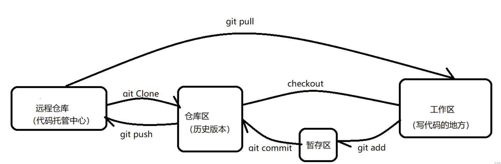

# ssh(Secure Shell)介绍
ssh=安全的加密网络协议,用于在不安全网络上执行远程命令和传输数据
## 一些概念
ssh=客户端工具,用来发送连接
sshd=服务端程序,用来接收连接
SSH=一种机密通信协议
主要工作:
- SSH用来远程连接
- 需要sshd(服务端)
- 默认22端口
- ssh user_name@ip 发起连接
- 建立加密通道
## ssh客户端&&服务端模型
客户端(ssh)
↓ 加密连接
SSH协议
↓ 
服务器(sshd)
## ssh命令
```bash
ssh user_name@ip "ls" # 远程执行命令
scp ./file01.txt user_name@ip:/path # 文件传输
```
# git
Git是一个免费开源的**分布式版本控制系统**

## git command 
```bash
关于配置
git config --list # 查看所有配置 
git config --global user.name # 查看用户名
git config --global user.email # 查看用户邮箱
git config --global user.name "new_user_name" # 设置新的用户名
git config --global user.emali "new_user_email" # 设置新的用户邮箱

关于远程仓库
git remote -v # 查看verbose远程仓库信息
git remote add 别名 "仓库地址" # 添加新的远程仓库
git remote set-url 别名 "仓库地址" # 设置远程仓库地址(原来已经存在的仓库)

关于工作流程
git init # 把当前文件夹初始化为git仓库
git status # 查看git状态
git clone "url" # 克隆地址
git branch b01 && git switch b01 # 创建b01分支&&切换到b01分支
git switch -c b01 # 切换到b01分支,-c自动create
git add . # 把工作区的所有修改全部都加入暂存区
git add test01.md test02.md # 把工作区的test01.md和test02.md添加到暂存区
git commit -m "提交备注" # 把暂存区的所有修改全部提交到本地
git merge "b01" # 把指定分支与main分支合并

关于push命令
git push origin main # 指定远程别名,分支推送
git push # 分支需要已经绑定upstream
git push -u origin main # 首次绑定+推送

关于日志
git log # 查看git提交日志

关于恢复/撤销
git restore test01.md # 撤销修改
git restore . # 撤销所有修改
git reset HEAD 文件名 # 取消add 
git reset HEAD . # 全部文件取消add
git reset HEAD~1 # 撤销最近一次提交,代码保留
```
# 从github连接仓库的三种方式
https && ssh && github CLI
## https
用账号+密码/Token来访问仓库
## ssh
用密钥连接github
eg: git clone git@github.com:user/repo.git
### ssh简介
ssh是一种**安全远程通信协议(protocol)**
作用: 在不安全网络上安全地远程操作另一台机器
需要:
- 客户端(ssh client)
- 服务端(ssh server,通常叫sshd)
